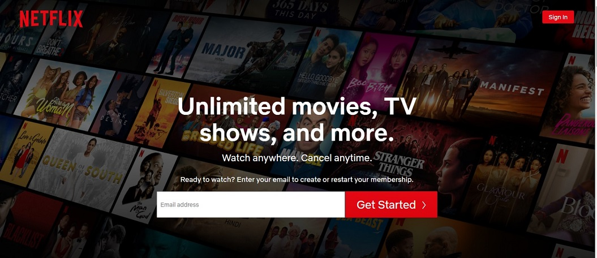
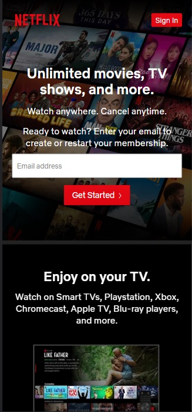

# Netflix Clone

This is a clone  of the netflix website. I used an API to get movie details and also one can log in.

## Table of contents

- [Overview](#overview)
  - [The challenge](#the-challenge)
  - [Screenshots](#screenshots)
  - [Links](#links)
- [My process](#my-process)
  - [Built with](#built-with)
  - [Layout](#layout)
- [Author](#author)

## Overview

### The challenge

Users should be able to:

- View the optimal layout depending on their device's screen size
- See hover states for all interactive elements on the pages

### Screenshots

### Links

- Solution URL: [Repository](https://github.com/kinjames/netflix)
- Live Site URL: [Github](https://kinjames.github.io/netflix/)

## My process

### Built with

- Semantic HTML5 markup
- CSS custom properties
- Scss
- Flexbox
- JavaScript

### Layout

The designs were created to the following widths:

- Mobile: 375px
- Desktop: 1140px

## Author

- Frontend Mentor - [@kinjames](https://www.frontendmentor.io/profile/kinjames)
- Twitter - [@TheBlackCoder7](https://twitter.com/TheBlackCoder7)
